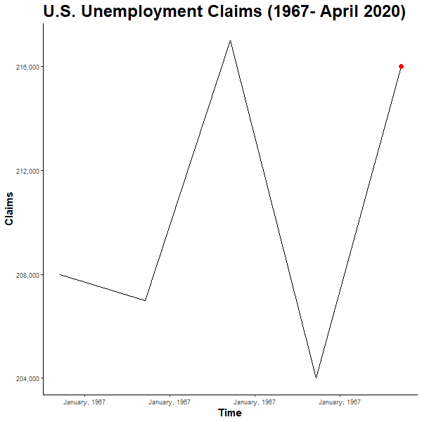

Unemployment Claims Animated
================
Jason Smith
5/2/2020

\#setup work

``` r
library(tidyverse)
```

    ## -- Attaching packages ---------------------------------------------------------------------- tidyverse 1.3.0 --

    ## v ggplot2 3.3.0     v purrr   0.3.4
    ## v tibble  3.0.0     v dplyr   0.8.5
    ## v tidyr   1.0.2     v stringr 1.4.0
    ## v readr   1.3.1     v forcats 0.5.0

    ## -- Conflicts ------------------------------------------------------------------------- tidyverse_conflicts() --
    ## x dplyr::filter() masks stats::filter()
    ## x dplyr::lag()    masks stats::lag()

``` r
library(gganimate)
library(readxl)
library(gifski)
setwd("C:\\Users\\Jason\\OneDrive\\Documents\\R Projects\\Unemployment graph")

unemployment <- read_excel("Unemployment.xlsx")

unemployment$week <- as.Date(unemployment$week, origin="1899-12-30")
```

\#Create the graph

``` r
graph <- ggplot(data = unemployment, aes(x=week, y=claims, group=1))+
  geom_line()+
  geom_point(color="red", size = 3)+
  theme_classic()+
  scale_y_continuous(labels = scales::comma)+
  scale_x_date(date_labels = "%B, %Y")+
  labs(title = "U.S. Unemployment Claims (1967- April 2020)", x = "Time", y = "Claims")+
  theme(axis.title = element_text(size = 15, face = "bold"), title = element_text(size=20, face = 'bold'))
```

\#Animate and save

``` r
anim <- graph+
  transition_reveal(week)+
  ease_aes('bounce-out')+
  view_follow()

animate(anim, nframes = 300, end_pause = 10, height=600, width=600)
```

<!-- -->

``` r
anim_save("unemployment_graph.gif")
```
